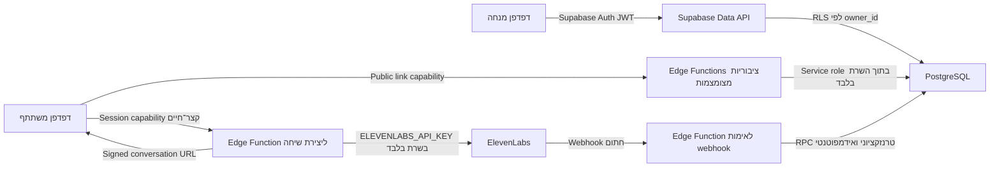

# תוכנית מעבר: מ־MVP מקומי למערכת פיילוט

> עדכון הרשאות: מיגרציה `202607190005_enable_shared_admin_workspace.sql` מחליפה את בידוד המנחים שתוכנן במסמך זה. כל אדמין קבוע ומחובר עובד במרחב משותף; `owner_id` נשמר כזהות היוצר בלבד. `anon` וממשק המשתתף נשארים מבודדים ומצומצמים.

סטטוס: תוכנית בלבד. בשלב זה לא הותקנו תלויות, לא נוצרו חשבונות, לא הופעלו migrations, לא הוגדרו סודות ולא בוצע חיבור רשת.

## 1. תמונת מצב והחלטות ארכיטקטוניות

### מה קיים היום

- אפליקציית React/Vite אחת עם נתיבי מנחים תחת `/admin` ונתיבי משתתפים תחת `/simulation/:publicToken`.
- `SimulationRepository` סינכרוני שממומש באמצעות `localSimulationRepository` ושומר סימולציות, קישורים, משתתפים, sessions ודוחות ב־`localStorage`.
- `participantSimulationService` יוצר `ParticipantSimulationView`, אך לפני הסינון הדפדפן כבר טוען את אובייקט הסימולציה המלא מהאחסון המקומי. דפוס זה אסור במערכת מרוחקת.
- session ציבורי מזוהה כרגע באמצעות `session` ב־query string ללא capability או אימות נפרד.
- `elevenLabsService` הוא mock בלבד; אין קול, signed URL או webhook אמיתי.
- אין Auth, טעינה אסינכרונית, RLS, טיפול בהתנגשויות עריכה, rate limiting או מדיניות שמירת מידע.

### ארכיטקטורת היעד



### החלטות מומלצות לפיילוט

1. שני פרויקטי Supabase נפרדים: staging ו־production. אין שיתוף DB, משתמשים או סודות ביניהם.
2. הרשמת מנחים היא invitation-only. אין signup ציבורי בפיילוט.
3. כל סימולציה שייכת למנחה יחיד באמצעות `owner_id = auth.uid()`. שיתוף בין מנחים אינו חלק מהפיילוט; אם יידרש בעתיד, מוסיפים workspaces ומ memberships ב־migration נפרד.
4. משתתפים אנונימיים אינם מקבלים הרשאת `anon` ישירה לטבלאות. כל הקריאות והכתיבות שלהם עוברות דרך Edge Functions.
5. קישור משתתף הוא capability חתום ובעל entropy גבוה. ביטול או החלפה מבטלים אותו בצד השרת.
6. session ציבורי מקבל capability נפרד, קצר־חיים ומוגבל ל־session אחד. הוא נשמר בזיכרון או ב־`sessionStorage`, לא ב־URL ולא ב־`localStorage`.
7. אין לשמור אודיו בפיילוט כברירת מחדל. תמלול, פרטי משתתף ודוחות נשמרים רק לפי מדיניות retention שתאושר לפני staging.
8. מימוש `localStorage` נשאר רק לבדיקות/פיתוח מקומי מאחורי adapter מפורש; staging ו־production חייבים להיכשל בהפעלה אם backend הוא `local`.

### החלטות שחייבות אישור לפני מימוש

- שיטת כניסת מנחים: magic link מומלץ לפיילוט, או סיסמה; האם נדרש MFA לפני production.
- אזור האחסון של Supabase ודרישות רגולטוריות/חוזיות של הארגון.
- אילו פרטי משתתף באמת נחוצים, מהו נוסח ההסכמה ומהי תקופת השמירה לכל סוג מידע.
- האם משוב מוצג למשתתף מיד, והאם דוחות/תמלולים נחשבים מידע הערכתי רגיש.
- האם ElevenLabs שומר אודיו או תמלול אצלו, ולכמה זמן; יש להתאים את הגדרות הספק למדיניות הארגון.
- ספק hosting, דומיין staging ודומיין production.

## 2. Supabase Auth למנחים

### 2.1 קבצים שייווצרו או ישתנו

חדשים:

- `src/lib/supabaseClient.ts` — יצירת client דפדפן עם URL ו־anon key ציבוריים בלבד.
- `src/config/runtime.ts` — אימות משתני סביבה ודרישה ל־Supabase ב־staging/production.
- `src/auth/AuthProvider.tsx` — טעינת session, האזנה לשינוי Auth וחשיפת מצב טעינה.
- `src/auth/RequireFacilitator.tsx` — חסימת `/admin` והפניה לכניסה.
- `src/pages/auth/LoginPage.tsx` — כניסה בעברית וב־RTL.
- `src/pages/auth/AuthCallbackPage.tsx` — השלמת magic link/OAuth והחזרת המשתמש לנתיב בטוח.
- `src/auth/AuthProvider.test.tsx` ו־`src/auth/RequireFacilitator.test.tsx`.

ישתנו:

- `src/App.tsx` — נתיבי `/login`, `/auth/callback` ועטיפת נתיבי admin ב־guard.
- `src/main.tsx` — הוספת `AuthProvider`.
- `src/layouts/AdminLayout.tsx` — הצגת מנחה מחובר ופעולת התנתקות.
- `package.json` ו־`pnpm-lock.yaml` — בהמשך בלבד, עבור `@supabase/supabase-js` וספריית ולידציה אם תיבחר.
- `.env.example` — `VITE_SUPABASE_URL`, `VITE_SUPABASE_ANON_KEY`, `VITE_APP_ENV`; ללא service role.
- `README.md` — תהליך כניסה והבדלי סביבות.

### 2.2 מודל נתונים

`facilitator_profiles`:

| עמודה | סוג | הערה |
|---|---|---|
| `id` | `uuid PK` | זהה ל־`auth.users.id`; FK עם `on delete restrict` בפיילוט |
| `display_name` | `text` | שם תצוגה, ללא הרשאות |
| `created_at` | `timestamptz` | ברירת מחדל `now()` |
| `updated_at` | `timestamptz` | מתעדכן בטריגר |

ה־email נשאר ב־Supabase Auth ואינו משוכפל לטבלה פרטית ללא צורך. יצירת profile תתבצע בטריגר מצומצם או בפעולת provisioning מבוקרת.

### 2.3 סיכוני אבטחה ופרטיות

- anon key הוא ציבורי; ההגנה היא RLS ולא הסתרתו.
- service-role key לעולם אינו נכנס למשתנה `VITE_*`, לקוד הדפדפן, ל־CI log או לכלי analytics.
- redirect URL פתוח עלול לאפשר open redirect; callback מחזיר רק לנתיבים פנימיים מורשים.
- session בדפדפן חשוף ל־XSS. יש CSP, הימנעות מ־HTML לא מהימן, audit לתלויות ו־`Referrer-Policy`.
- יש לבטל signup ציבורי, לאמת email ולהגדיר expiration סביר ל־magic links.
- הודעות שגיאה בכניסה לא צריכות לאשר האם כתובת מסוימת קיימת.

### 2.4 סדר ביצוע

1. להחליט על magic link/סיסמה ועל מדיניות הזמנה.
2. ליצור migrations ל־profile ול־RLS שלו.
3. להוסיף client ו־AuthProvider עם mocks בבדיקות.
4. להוסיף מסכי כניסה ו־guard, בלי לחבר עדיין את repository ל־DB.
5. להוסיף logout, loading ו־expired-session states.
6. להפעיל invitation-only ב־staging ולבצע smoke test עם שני מנחים.

### 2.5 בדיקות נדרשות

- Unit: session נטען, logout מנקה state, callback דוחה return path חיצוני.
- Component: משתמש אנונימי מופנה ל־login; משתמש מחובר רואה admin; participant routes נשארים ציבוריים.
- Integration: token שפג תוקפו גורם לכניסה מחדש בלי לחשוף נתונים מהמסך הקודם.
- Security: אין service role ב־bundle, ב־source maps, ב־localStorage או בלוגים.
- Accessibility: טופס כניסה בעברית, RTL, labels ושגיאות נגישות.

### 2.6 פעולות ידניות בשירותים החיצוניים

- ליצור פרויקט Supabase staging ופרויקט production נפרד.
- לבחור region לפי דרישות פרטיות לפני יצירת נתוני אמת.
- להגדיר Site URL ו־redirect allowlist נפרדים לכל סביבה.
- לבטל public signup ולהזמין ידנית את מנחי הפיילוט.
- להגדיר תבניות email ממותגות ומדיניות expiration.
- להפעיל MFA לפני production אם מדיניות הארגון דורשת זאת.

## 3. PostgreSQL/Supabase ושכבת repository אסינכרונית

### 3.1 קבצים שייווצרו או ישתנו

חדשים:

- `supabase/config.toml` — תצורת Supabase מקומית עתידית, ללא סודות.
- `supabase/migrations/202607190001_extensions_and_types.sql`.
- `supabase/migrations/202607190002_profiles_and_simulations.sql`.
- `supabase/migrations/202607190003_links_participants_sessions.sql`.
- `supabase/migrations/202607190004_transcripts_reports_webhooks.sql`.
- `supabase/migrations/202607190005_rls.sql`.
- `supabase/migrations/202607190006_rpcs_and_constraints.sql`.
- `supabase/seed.sql` — נתונים סינתטיים בלבד; לא נטען אוטומטית ל־production.
- `src/repositories/supabaseSimulationRepository.ts`.
- `src/repositories/index.ts` — בחירת adapter לפי סביבה והזרקה מפורשת.
- `src/types/database.generated.ts` — נוצר מהסכמה; אין לערוך ידנית.
- `src/repositories/supabaseSimulationRepository.test.ts`.

ישתנו:

- `src/types/simulation.ts` — הפרדה בין domain models, DTOs של DB ו־public DTOs.
- `src/repositories/persistenceContracts.ts` — מעבר מחוזה סינכרוני ל־`Promise`, והפרדה בין admin repository ל־public gateway.
- `src/repositories/localSimulationRepository.ts` — התאמת adapter מקומי לחוזה האסינכרוני לצורכי test/dev בלבד.
- `src/hooks/useRepositoryRevision.ts` — החלפה ב־hooks אסינכרוניים עם loading/error/refetch; אין להסתמך על אירועי storage ב־Supabase.
- כל `src/pages/admin/*` — טיפול אסינכרוני, optimistic state רק במקום בטוח, errors ו־conflict state.
- `src/pages/participant/*` — לא ייבאו עוד repository פרטי.

### 3.2 מודל נתונים

#### `simulations`

| עמודה | סוג | הערה |
|---|---|---|
| `id` | `uuid PK` | נוצר בשרת/DB |
| `owner_id` | `uuid not null` | FK ל־`auth.users`; בסיס ה־RLS |
| `status` | enum | `draft`, `published`, `unpublished`, `deleted` |
| `title` | `text` | עם check לאורך סביר |
| `organization` | `jsonb` | מיפוי `OrganizationContext` |
| `scenario` | `jsonb` | כולל מידע גלוי ופנימי; לעולם לא מוחזר כולו לציבור |
| `character` | `jsonb` | הגדרות הדמות המלאות |
| `behavior` | `jsonb` | התנגדות, טריגרים ותנאי הצלחה |
| `participant_brief` | `jsonb` | בסיס ל־public projection |
| `participant_fields` | `jsonb` | שדות שהמנחה הפעיל |
| `facilitator_configuration` | `jsonb` | פנימי בלבד |
| `learning_objectives` | `jsonb` | פנימי; חשיפה עתידית רק לפי allowlist |
| `version` | `integer` | optimistic concurrency; גדל בכל update |
| `published_at`, `created_at`, `updated_at`, `deleted_at` | `timestamptz` | soft delete כברירת מחדל |

לשלב הפיילוט JSONB שומר התאמה למודל הקיים ומצמצם rewrite. שדות שיידרשו לחיפוש/דוחות רוחביים ינורמלו ב־migration עתידי. `attemptCount` לא נשמר כמקור אמת; הוא מחושב מ־sessions באמצעות view/RPC.

#### `simulation_share_links`

| עמודה | סוג | הערה |
|---|---|---|
| `id` | `uuid PK` | מזהה קישור |
| `simulation_id`, `owner_id` | `uuid` | FKs; owner משוכפל ומאומת בטריגר |
| `version` | `integer` | החלפה מגדילה version ומבטלת tokens ישנים |
| `status` | enum | `active`, `unpublished`, `replaced`, `deleted`, `expired` |
| `expires_at` | `timestamptz null` | אופציונלי לפיילוט מוגבל בזמן |
| `created_at`, `revoked_at` | `timestamptz` | audit בסיסי |

הקישור הציבורי יהיה token חתום בשרת עם claims מצומצמים (`link_id`, `version`, `scope`) וללא PII. ה־DB לא צריך לשמור את ה־token הגולמי. יצירה מחדש של URL מתבצעת רק ב־Edge Function מאומתת; שינוי version מבטל קישורים קודמים.

#### `participants`

| עמודה | סוג | הערה |
|---|---|---|
| `id` | `uuid PK` | גם השתתפות אנונימית מקבלת מזהה פנימי |
| `simulation_id`, `owner_id` | `uuid` | בידוד המנחה |
| `details` | `jsonb` | רק שדות enabled שעברו validation |
| `consented_at` | `timestamptz` | חובה לפני session |
| `consent_version` | `text` | הגרסה שהוצגה בפועל |
| `created_at`, `purge_after` | `timestamptz` | תמיכה ב־retention |

#### `simulation_sessions`

| עמודה | סוג | הערה |
|---|---|---|
| `id` | `uuid PK` | מזהה פנימי, לא הרשאה |
| `simulation_id`, `share_link_id`, `participant_id`, `owner_id` | `uuid` | קשר מלא לבעלות ולמקור |
| `status` | enum | `created`, `ready`, `in_progress`, `processing`, `completed`, `failed`, `expired` |
| `capability_version` | `integer` | מאפשר ביטול session tokens |
| `provider` | `text` | `elevenlabs` |
| `provider_conversation_id` | `text unique null` | נכתב בשרת בלבד |
| `started_at`, `ended_at`, `duration_seconds`, `last_event_at` | זמן/מספר | ערכים מאומתים |
| `error_code` | `text null` | קוד מצומצם ללא payload רגיש |
| `created_at`, `updated_at`, `purge_after` | `timestamptz` | lifecycle ו־retention |

#### `session_transcript_entries`

`id`, `session_id`, `owner_id`, `sequence`, `speaker`, `text`, `timestamp_ms`, `provider_event_id`, `created_at`; unique על `(session_id, sequence)` ועל event id כאשר קיים.

#### `simulation_reports`

`id`, `session_id unique`, `owner_id`, `summary`, `scores jsonb`, `strengths text[]`, `improvements text[]`, `provider_version`, `created_at`, `updated_at`, `purge_after`.

#### `provider_webhook_events`

`provider`, `provider_event_id unique`, `conversation_id`, `session_id`, `payload_sha256`, `status`, `received_at`, `processed_at`, `error_code`, `attempt_count`. לא שומרים raw payload כברירת מחדל. אם נדרש debug, שומרים payload מוצפן/מוגבל לזמן קצר לאחר אישור פרטיות.

#### `audit_events` — מומלץ

אירועים מצומצמים כגון publish, unpublish, regenerate link, soft delete ו־report viewed. אין לשמור transcript או פרטי משתתף בתוך metadata של audit.

### 3.3 סיכוני אבטחה ופרטיות

- PII ותמלולים הם מידע רגיש; יש איסוף מינימלי, retention, מחיקה מתוזמנת ותהליך בקשת מחיקה.
- JSONB עלול להכניס שדות לא צפויים; כל write עובר runtime validation ו־DB constraints.
- עדכון מקביל עלול לדרוס עריכה; `version` משמש optimistic concurrency ומחזיר conflict ברור.
- `on delete cascade` עלול למחוק היסטוריה בטעות; בפיילוט משתמשים ב־soft delete וב־FK מסוג restrict, ו־purge הוא תהליך נפרד ומאושר.
- אין להעתיק נתוני `localStorage` אוטומטית לענן. seed הוא סינתטי בלבד.
- אין לכלול payload מלא של ספק בלוגים או בטבלת webhook.

### 3.4 סדר ביצוע

1. לאשר retention, שדות PII ו־soft-delete semantics.
2. לכתוב migrations מצטברים וניתנים לחזרה ללא drop של נתוני אמת.
3. להוסיף constraints, indexes ו־updated_at trigger.
4. להוסיף RLS ולבדוק אותו לפני חיבור UI.
5. להפוך את חוזי repository לאסינכרוניים ולהתאים תחילה את adapter המקומי.
6. לממש Supabase adapter ולהעביר מסך admin אחד בכל פעם: list, create/edit, publish/share, results.
7. להשאיר feature flag מקומי רק ל־dev/test; staging חייב להשתמש ב־Supabase.

### 3.5 בדיקות נדרשות

- Contract tests זהים ל־local adapter ול־Supabase adapter.
- Unit: מיפוי JSONB ל־domain, validation, version conflict, soft delete.
- DB: FK, enum/check constraints, uniqueness, timestamps ו־owner consistency trigger.
- Integration: create → edit → publish → unpublish → regenerate → results.
- Failure: timeout, token expired, network offline, duplicate submit ו־retry idempotent.
- Migration: schema נקי עולה מאפס; staging קיים מתקדם migration אחד קדימה; rollback תפעולי מתועד.

### 3.6 פעולות ידניות בשירותים החיצוניים

- להתקין/לאשר Supabase CLI רק בשלב המימוש.
- לקשר את ה־CLI לפרויקט staging, ולהחיל migrations עליו לפני production.
- להפעיל גיבויים/Point-in-Time Recovery בהתאם לחבילת Supabase ולרגישות הנתונים.
- לאשר ידנית כל migration destructive; ברירת המחדל היא expand-and-contract.
- לבחור retention ולהקים תהליך purge רק לאחר אישור משפטי/פרטיות.

## 4. Row Level Security ובידוד בין מנחים

### 4.1 קבצים שייווצרו או ישתנו

- `supabase/migrations/202607190005_rls.sql` — הפעלת RLS וכל policies.
- `supabase/migrations/202607190006_rpcs_and_constraints.sql` — triggers/RPCs עם הרשאות מצומצמות.
- `supabase/tests/rls_facilitator_isolation.sql` — בדיקות שני מנחים ו־anon.
- `supabase/tests/security_definer_permissions.sql` — בדיקת grants ו־`search_path`.
- `docs/security-model.md` — מטריצת roles/resources/actions שתיווצר בשלב המימוש.

### 4.2 מודל הרשאות

| טבלה | מנחה בעלים | מנחה אחר | `anon` | Edge/service role |
|---|---|---|---|---|
| `facilitator_profiles` | self select/update מוגבל | אין | אין | provisioning בלבד |
| `simulations` | CRUD עם soft delete | אין | אין | פעולות שרת נחוצות |
| `simulation_share_links` | select metadata; שינוי דרך function | אין | אין | create/revoke/mint |
| `participants` | select לפי owner | אין | אין | insert מ־public session |
| `simulation_sessions` | select לפי owner | אין | אין | lifecycle writes |
| `session_transcript_entries` | select לפי owner | אין | אין | webhook writes |
| `simulation_reports` | select לפי owner | אין | אין | webhook/RPC writes |
| `provider_webhook_events` | אין כברירת מחדל | אין | אין | webhook בלבד |

Policies משתמשים ב־`owner_id = auth.uid()` וב־`with check (owner_id = auth.uid())`. אין להסתמך על email או user metadata שניתן לשינוי. child rows כוללים `owner_id` לצורך policy פשוטה, וטריגר DB מאמת שהוא זהה לבעלים של הסימולציה כדי למנוע spoofing.

### 4.3 סיכוני אבטחה ופרטיות

- policy חסרה אחת יכולה לפתוח טבלה שלמה; RLS מופעל בכל הטבלאות לפני grants.
- service role עוקף RLS; כל Edge Function חייבת לבצע authorization מפורש ולא לסמוך על RLS בלבד.
- `security definer` מסוכן אם `search_path` פתוח. מגדירים `search_path = ''`, שמות schema מלאים ו־revoke execute מ־`public`/`anon`.
- Views עלולות לעקוף ציפיות RLS; משתמשים ב־`security_invoker` או RPC מצומצם.
- מנחה שמנחש UUID של מנחה אחר חייב לקבל zero rows/404 אחיד, לא מידע על קיום הרשומה.

### 4.4 סדר ביצוע

1. להפעיל RLS על כל טבלה מיד עם יצירתה.
2. להוסיף policies מינימליות ל־profiles ול־simulations.
3. להוסיף owner consistency triggers לטבלאות הילדים.
4. להוסיף read policies למנחה; writes של session/report נשארים server-only.
5. להקשיח grants על functions/views.
6. להריץ בדיקות בידוד לפני חיבור UI ולפני כל deploy.

### 4.5 בדיקות נדרשות

- משתמש A אינו יכול select/update/delete סימולציה, session, participant או report של B.
- A אינו יכול להכניס row עם `owner_id` של B או `simulation_id` של B.
- `anon` מקבל zero access לכל הטבלאות הפרטיות.
- owner יכול לבצע את הפעולות המותרות בלבד.
- service-role function דוחה JWT חסר/שגוי ובודקת בעלות לפני פעולה מנהלית.
- בדיקות regression לכל policy בכל migration.

### 4.6 פעולות ידניות בשירותים החיצוניים

- לעבור ב־Supabase Dashboard על RLS enabled לכל טבלה לאחר apply ב־staging.
- לבדוק שאין policies או grants שנוצרו ידנית מחוץ ל־migrations.
- ליצור שני משתמשי staging נפרדים ולהריץ תרחיש בידוד ידני נוסף.
- לאשר production רק לאחר review של SQL בידי אדם נוסף.

## 5. endpoint ציבורי שמחזיר רק `ParticipantSimulationView`

### 5.1 קבצים שייווצרו או ישתנו

חדשים:

- `supabase/functions/public-simulation/index.ts` — אימות public link והחזרת DTO מצומצם.
- `supabase/functions/start-public-session/index.ts` — validation של שדות, consent ויצירת participant/session.
- `supabase/functions/admin-share-link/index.ts` — יצירה, הצגה מחדש, ביטול והחלפת link למנחה מאומת.
- `supabase/functions/_shared/publicLinks.ts` — חתימה, אימות, scope ו־version.
- `supabase/functions/_shared/sessionCapabilities.ts` — capability קצר־חיים ל־session.
- `supabase/functions/_shared/participantView.ts` — mapper יחיד עם allowlist מפורש.
- `supabase/functions/_shared/validation.ts`, `cors.ts`, `responses.ts`, `rateLimit.ts`.
- `src/services/publicSimulationApi.ts` ו־`src/services/publicSessionApi.ts`.
- בדיקות function ו־DTO תחת `supabase/functions/**/__tests__` או test harness ייעודי.

ישתנו:

- `src/services/participantSimulationService.ts` — `toParticipantSimulationView` יישאר עבור preview admin/tests, אך public fetch יעבור לשרת.
- `src/pages/participant/ParticipantLandingPage.tsx` — loading/error, fetch ציבורי ו־start session אסינכרוני.
- `src/pages/participant/ParticipantSessionPage.tsx` ו־`ParticipantCompletePage.tsx` — שימוש ב־session capability, ללא import של repository פרטי.
- `src/types/simulation.ts` — DTO ציבורי versioned וחוזי request/response.
- `index.html`/תצורת hosting — `Referrer-Policy: no-referrer`; רצוי self-host של הפונט כדי לצמצם צד שלישי בדף עם token.

### 5.2 מודל נתונים וחוזי API

`GET/POST public-simulation` מקבל public link token, מאמת חתימה, scope, version, status, expiration וסטטוס simulation. הוא מחזיר רק:

```ts
interface ParticipantSimulationView {
  publicToken: string
  title: string
  organizationLabel?: string
  participantBrief: ParticipantBrief
  participantFields: ParticipantField[] // enabled בלבד
  character: { name: string; role: string }
  scenarioSummary: string
}
```

אסור לבצע `select *` ואז לסנן בדפדפן. ה־function בוחרת עמודות מפורשות ומרכיבה allowlist. אין בתגובה `owner_id`, `simulation_id`, hidden info, behavior, prompts, internal notes, objectives פנימיות, provider IDs או DB metadata.

`start-public-session` מקבל link token, `details`, אישור consent ו־idempotency key. הוא מאמת את השדות מול `participantFields`, יוצר participant ו־session בטרנזקציה ומחזיר:

- `sessionId` לצורכי UI בלבד.
- `sessionCapability` חתום, scope ל־session יחיד ו־TTL קצר.
- `expiresAt`.

ה־capability אינו נכתב ל־URL. refresh יכול להשתמש ב־`sessionStorage`; עם סיום/expiry הוא נמחק.

### 5.3 סיכוני אבטחה ופרטיות

- public token ב־URL עלול להיכנס ל־history, referrer או logs. משתמשים ב־entropy גבוה, no-referrer, אין analytics בדף הפיילוט, redaction בלוגים ויכולת revoke.
- endpoint ניתן לסריקה/DoS; מוסיפים rate limit, timeout, payload size limit ותגובות אחידות.
- שגיאות שונות עלולות לאפשר enumeration. `not_found` ו־token לא תקין מחזירים תגובה כללית; סטטוס revoked ידידותי רק לאחר token חתום תקין.
- שדות משתתף חייבים server-side validation; אין לסמוך על ה־required checks של React.
- idempotency key מונע יצירת participants/sessions כפולים בלחיצה כפולה.
- session ID לבדו לעולם אינו הרשאה.

### 5.4 סדר ביצוע

1. לממש signing/verification ו־DB status/version checks.
2. לכתוב mapper allowlist ובדיקות negative-property לפני חיבור route.
3. לממש public-simulation עם CORS origin מדויק ו־rate limiting.
4. לממש start-public-session כפעולה טרנזקציונית ואידמפוטנטית.
5. להעביר את LandingPage ל־API החדש.
6. להעביר Session/Complete ל־capability ולהסיר import של repository פרטי.
7. לבדוק revoke/replace/expired end-to-end.

### 5.5 בדיקות נדרשות

- Snapshot/contract של `ParticipantSimulationView` ובדיקות מפורשות ששדות פנימיים אינם קיימים גם לאחר הרחבת מודל Simulation.
- public token תקין, פג, מבוטל, מוחלף, altered ועם signature שגויה.
- rate limit, payload גדול, CORS origin זר ו־method לא נתמך.
- required/custom/email fields, שדות עודפים, consent חסר ו־idempotency חוזר.
- session ID ללא capability, capability של session אחר ו־capability שפג.
- E2E: publish → public brief → participant details → start session.

### 5.6 פעולות ידניות בשירותים החיצוניים

- להגדיר `PUBLIC_LINK_SIGNING_SECRET` ו־`PUBLIC_SESSION_SIGNING_SECRET` שונים בכל סביבת Edge; לא ב־Git.
- להגדיר allowed origins של staging/production.
- להגדיר retention/redaction ללוגים ולוודא שטוקנים ו־PII אינם נרשמים.
- להחליט על expiration של public links ושל session capabilities.
- להגדיר header `Referrer-Policy` ו־CSP בפלטפורמת hosting הנבחרת.

## 6. Edge Function מאובטחת ל־ElevenLabs ו־signed URL

### 6.1 קבצים שייווצרו או ישתנו

- `supabase/functions/create-conversation/index.ts`.
- `supabase/functions/end-conversation/index.ts` — רק אם נדרש מה־API של הספק; אחרת הפעולה נשארת בצד client SDK עם session מוגבל.
- `supabase/functions/_shared/elevenLabs.ts` — client server-side עם timeout, redaction ומיפוי שגיאות.
- `supabase/functions/_shared/sessionCapabilities.ts` — אימות scope לפני פנייה לספק.
- `src/services/elevenLabsService.ts` — החלפת mock בקריאה ל־Edge Function והפעלת SDK עם signed URL בלבד.
- `src/pages/participant/ParticipantSessionPage.tsx` — lifecycle אמיתי, הרשאות microphone, reconnect ו־failure states.
- `.env.example` — תיעוד שמות server secrets ללא ערכים; `ELEVENLABS_API_KEY` אינו משתנה `VITE_*`.
- בדיקות mock לספק ול־Edge Function.

### 6.2 מודל נתונים וחוזה

`create-conversation` מקבל `sessionCapability` ו־idempotency key. ה־function:

1. מאמתת חתימה, TTL, scope ו־session status.
2. טוענת server-side את הגדרות הדמות וה־prompt הפנימיים; דבר מהם אינו מוחזר לדפדפן.
3. מבקשת מ־ElevenLabs signed conversation URL קצר־חיים באמצעות `ELEVENLABS_API_KEY`.
4. שומרת `provider_conversation_id` וקישורו ל־session.
5. מחזירה רק signed URL, conversation id מצומצם ו־expiry שנחוצים ל־SDK.

יש לבדוק בזמן המימוש את החוזה העדכני מול התיעוד הרשמי של ElevenLabs; אין לנחש endpoint, TTL או הרשאות signed URL ללא אימות.

### 6.3 סיכוני אבטחה ופרטיות

- API key נשאר secret של Edge בלבד. אין להחזירו, להדפיס headers או לכלול provider response מלא בלוג.
- signed URL הוא bearer credential קצר־חיים; מנפיקים רק ל־session פעיל, פעם אחת/באידמפוטנטיות, עם rate limit.
- מנחה או משתתף עלולים לשנות agent/prompt בבקשה; השרת מתעלם משדות כאלה וטוען config מה־DB.
- prompt injection מתמלול/קלט המשתתף אינו אמור לשנות הרשאות או לחשוף hidden info; system prompt נבנה בתבנית שרת קשיחה.
- microphone permission ונתוני קול דורשים notice והסכמה ברורים.
- reconnect/retry עלולים ליצור שיחות כפולות ועלויות; משתמשים ב־idempotency וב־status machine.

### 6.4 סדר ביצוע

1. לאשר חשבון/agent וסביבת ElevenLabs נפרדת ל־staging.
2. להגדיר secret server-side בלבד.
3. לממש adapter לספק עם mock tests מלאים.
4. לממש create-conversation ולשמור mapping ל־session.
5. לחבר SDK בדפדפן באמצעות signed URL בלבד.
6. להוסיף start/stop/reconnect/permission-denied states.
7. לוודא עלויות, quotas ו־rate limits ב־staging.

### 6.5 בדיקות נדרשות

- valid/expired/wrong-session capability.
- session לא פעיל, link שבוטל ו־double request עם אותו idempotency key.
- provider timeout, 4xx, 5xx, quota exceeded ותגובה חסרה.
- בדיקת bundle/logs שאין API key, prompt פנימי או service role.
- E2E staging עם microphone אמיתי, stop, reconnect וסגירת tab.
- בדיקת עלות: לכל session נוצר לכל היותר conversation פעיל אחד.

### 6.6 פעולות ידניות בשירותים החיצוניים

- ליצור agent ייעודי ל־staging ו־agent נפרד ל־production, או לאשר הפרדה שקולה בחשבון.
- ליצור API keys שונים, עם scope מינימלי ורוטציה מתועדת.
- להגדיר `ELEVENLABS_API_KEY`, `ELEVENLABS_AGENT_ID` ופרטי agent כ־Edge secrets.
- לבדוק/להגדיר מדיניות שמירת אודיו ותמלול ב־ElevenLabs.
- להגדיר quotas/alerts כדי למנוע שימוש חריג ועלויות לא צפויות.

## 7. Webhook מאומת לתמלול ולתוצאות

### 7.1 קבצים שייווצרו או ישתנו

- `supabase/functions/elevenlabs-webhook/index.ts`.
- `supabase/functions/_shared/verifyElevenLabsWebhook.ts`.
- `supabase/functions/_shared/webhookSchemas.ts` — validation versioned של payloads.
- `supabase/migrations/202607190004_transcripts_reports_webhooks.sql` — events/transcripts/reports.
- `supabase/migrations/202607190006_rpcs_and_constraints.sql` — RPC טרנזקציוני `process_elevenlabs_event`.
- `src/pages/admin/SimulationResultsPage.tsx` — loading/processing/failed/report-ready states.
- `src/types/simulation.ts` — statuses ותוצאות provider.
- בדיקות webhook חתימה, replay, סדר אירועים ו־idempotency.

### 7.2 מודל נתונים וזרימת עיבוד

1. ה־function קוראת raw body לפני JSON parsing.
2. מאמתת signature ו־timestamp לפי המפרט הרשמי העדכני של ElevenLabs, בהשוואה constant-time ובחלון replay קצר.
3. בודקת payload size ו־runtime schema.
4. מוצאת session לפי `provider_conversation_id`; אירוע לא מוכר אינו יוצר session חדש.
5. מכניסה `provider_webhook_events` עם unique event id/payload hash.
6. RPC אחד מעדכן session, transcript entries ודוח בטרנזקציה.
7. אירוע חוזר מחזיר הצלחה אידמפוטנטית ללא כפילות.

אם הספק אינו מספק event id יציב, מייצרים מפתח אידמפוטנטיות משילוב conversation id, event type, timestamp ו־payload hash.

### 7.3 סיכוני אבטחה ופרטיות

- אין לעבד webhook לפני signature verification.
- יש למנוע replay באמצעות timestamp tolerance ו־unique event key.
- payload עלול להיות גדול או זדוני; מגבילים גודל, סוגים ואורך transcript.
- אירועים עלולים להגיע מחוץ לסדר; status machine אינה מאפשרת חזרה מ־completed ל־in_progress.
- אין להחזיר פרטי שגיאה פנימיים לספק ואין לרשום transcript בלוג.
- reports אוטומטיים צריכים להיות מסומנים כהערכת AI ולא כאמת מוחלטת; יש להגדיר למי מותר לראותם ולכמה זמן.

### 7.4 סדר ביצוע

1. לאמת את מפרט החתימה הרשמי של ElevenLabs בזמן המימוש.
2. לכתוב verifier עם test vectors לפני יצירת endpoint.
3. ליצור event table ו־RPC טרנזקציוני.
4. לממש endpoint עם raw-body verification ו־schema validation.
5. לחבר staging webhook ולשמור רק metadata מינימלי.
6. להציג processing/completed/failed בממשק המנחה.
7. לבדוק retry/replay/out-of-order לפני production.

### 7.5 בדיקות נדרשות

- signature תקינה, שגויה, חסרה, timestamp ישן וגוף ששונה אחרי החתימה.
- אותו event פעמיים, שני events מחוץ לסדר ו־concurrent delivery.
- conversation id לא מוכר או ששייך לסביבת staging אחרת.
- transcript ארוך/לא תקין, speaker לא מוכר ו־report חלקי.
- DB transaction נכשל באמצע ואפשר לבצע retry בטוח.
- מנחה אחר אינו יכול לקרוא את ה־session/report שנוצר.

### 7.6 פעולות ידניות בשירותים החיצוניים

- ליצור webhook endpoint של staging ב־ElevenLabs ורק לאחר אישור גם production.
- להגדיר webhook secret שונה בכל סביבה ולשמור אותו ב־Edge secrets.
- לבחור events מדויקים הדרושים לתמלול/סיום/תוצאות ולהימנע מאירועים מיותרים.
- להפעיל webhook delivery logs אצל הספק בלי להעתיק PII למערכות נוספות.
- לבצע רוטציה מבוקרת של secret עם חלון מעבר אם הספק תומך בכך.

## 8. סביבת staging לפני production

### 8.1 קבצים שייווצרו או ישתנו

- `docs/environments.md` — מטריצת staging/production ומשתנים מותרים.
- `docs/deployment-runbook.md` — deploy, smoke, rollback ו־incident steps.
- `docs/privacy-and-retention.md` — קטגוריות מידע, retention ו־purge.
- `.env.example` — ערכים ריקים בלבד והסבר public/server.
- קובץ CI עתידי לפי פלטפורמת Git שתיבחר, להרצת test/build/migration checks ללא deploy אוטומטי ל־production.
- תצורת hosting ייעודית לספק שייבחר: headers, CSP, no-referrer ו־environment variables.

### 8.2 מודל סביבות

| רכיב | staging | production |
|---|---|---|
| Supabase project | נפרד | נפרד |
| Auth users | מנחי בדיקה בלבד | מנחי פיילוט מאושרים |
| DB data | סינתטי בלבד | נתוני פיילוט לפי הסכמה |
| ElevenLabs key/agent | נפרד | נפרד |
| Webhook URL/secret | נפרד | נפרד |
| Frontend domain | תת־דומיין staging | דומיין production |
| Logs/alerts | debug מצומצם ללא PII | redaction ו־alerts מחמירים |

### 8.3 סיכוני אבטחה ופרטיות

- אסור להעתיק production DB ל־staging ללא אנונימיזציה ואישור.
- ערבוב secrets/URLs בין סביבות עלול לשלוח נתונים לספק הלא נכון; `VITE_APP_ENV` ו־project IDs נבדקים בזמן boot/deploy.
- staging פתוח לאינטרנט עלול להפוך ל־production לא מנוהל; יש Auth, robots noindex ו־access restriction אם אפשר.
- source maps/logs עלולים לחשוף מידע; מגדירים גישה ו־retention.
- production deploy חייב להיות promotion של commit/migration שעברו staging, לא שינוי ידני בדשבורד.

### 8.4 סדר ביצוע

1. ליצור staging מלא ומבודד.
2. להחיל migrations ולהריץ RLS/contract tests.
3. לפרוס frontend staging עם public env בלבד.
4. לחבר ElevenLabs staging ו־webhook.
5. להריץ E2E, privacy/security checklist ותרחיש rollback.
6. לתקן ב־code/migration ולחזור על staging; אין תיקונים ידניים רק ב־DB.
7. ליצור production רק לאחר exit review, להחיל migrations ואז frontend/functions.
8. לבצע smoke test ללא PII אמיתי לפני הזמנת המשתמשים.

### 8.5 בדיקות נדרשות

- `pnpm test` ו־`pnpm build` בכל commit מועמד.
- migration lint/dry-run וסכמה נקייה מאפס.
- RLS tests עם שני מנחים ו־anon.
- E2E מלא: login → create/edit → publish → public session → signed voice → webhook → report.
- revoke link במהלך session, expiry, provider outage ו־retry.
- bundle secret scan, CSP/no-referrer, CORS ו־security headers.
- גיבוי/שחזור ו־rollback runbook בתרגיל staging.

### 8.6 פעולות ידניות בשירותים החיצוניים

- ליצור שני פרויקטי Supabase ושתי תצורות ElevenLabs נפרדות.
- לבחור ולחבר hosting ודומיינים נפרדים.
- להגדיר secrets בכל סביבה דרך dashboard/CLI מאושר בלבד.
- להגדיר backups, alerts, quotas, log retention ו־status notifications.
- לבצע review ידני לפני production deploy ולאשר את רשימת המנחים.
- לאשר נוסח פרטיות/הסכמה, retention ודרך טיפול בבקשות מחיקה.

## 9. סדר ביצוע כולל ושערי מעבר

1. **שער פרטיות והחלטות:** region, Auth, PII, consent, retention, אודיו ודוחות מאושרים.
2. **תשתית repository:** async contracts ו־local adapter תואם; ה־UI עדיין מקומי ועובר בדיקות.
3. **סכמה ו־RLS:** migrations, constraints ו־SQL tests; אין UI מרוחק לפני בידוד מוכח.
4. **Auth מנחים:** login/guard/logout ב־staging.
5. **Admin Supabase adapter:** dashboard, editor, preview, publish/share/results; version conflicts ו־soft delete.
6. **Public boundary:** public-simulation ו־start-public-session; הסרת imports של private repository ממסכי participant.
7. **Session capability:** lifecycle ציבורי ללא session ID כהרשאה.
8. **ElevenLabs signed URL:** key ב־Edge בלבד, שיחה אמיתית ב־staging.
9. **Webhook:** signature, idempotency, transcript/report transaction.
10. **Staging hardening:** E2E, RLS, secret scan, retention, rollback, quotas ו־privacy review.
11. **Production readiness:** פרויקט נפרד, smoke test, הזמנות מנחים וניטור.

אין לבצע migration אוטומטי של `localStorage`. אם יימצאו נתונים מקומיים אמיתיים שצריך לשמר, מתכננים export/import נפרד, מצומצם, מאומת ומאושר; נתוני demo נזרעים מחדש כנתונים סינתטיים.

## 10. מטריצת בדיקות מסכמת

| שכבה | בדיקות חובה |
|---|---|
| Domain/DTO | mapper, validation, negative properties, versioning |
| Repository | contract tests, async errors, conflicts, idempotency |
| Auth UI | anonymous/authenticated/expired/logout/callback |
| PostgreSQL | constraints, FK, indexes, soft delete, migrations |
| RLS | owner, other facilitator, anon, forged owner_id |
| Public API | token states, allowlist, rate limit, CORS, field validation |
| Session | capability scope/expiry/replay, duplicate start/finish |
| ElevenLabs | provider failures, one conversation per session, no key exposure |
| Webhook | signature, timestamp, replay, ordering, transaction retry |
| E2E staging | מנחה עד דוח מלא, revoke, outage ו־recovery |
| Release | test, build, secret scan, migration review, smoke, rollback |

## 11. קריטריוני סיום לפיילוט

- שני מנחים נפרדים אינם יכולים לקרוא או לשנות מידע זה של זה בכל שכבה.
- `anon` אינו יכול לקרוא אף טבלה פרטית ישירות.
- תגובת public endpoint תואמת בדיוק ל־`ParticipantSimulationView` ונבדקת נגד דליפת שדות.
- אין service role או ElevenLabs API key בדפדפן, ב־bundle, ב־source maps או בלוגים.
- signed URL מונפק רק ל־session תקף וקצר־חיים.
- webhook דוחה חתימה שגויה, עמיד ל־replay ומעבד retry ללא כפילות.
- staging עבר E2E, בדיקות פרטיות/אבטחה ותרגיל rollback לפני production.
- קיימים retention, soft delete, purge מאושר ותהליך תגובה לאירוע.
- כל `pnpm test`, `pnpm build`, בדיקות RLS ו־migration checks עוברים על ה־commit המועמד.

## 12. פעולות שלא מבוצעות בשלב התכנון הזה

- אין התקנת `@supabase/supabase-js`, Supabase CLI, SDK של ElevenLabs או תלויות אחרות.
- אין יצירת פרויקטים, משתמשים, agents, webhooks, domains או secrets.
- אין הפעלת SQL, migration, Edge Function, deploy או חיבור רשת.
- אין שינוי ב־React, repository, routes, types או configuration הקיימים.
